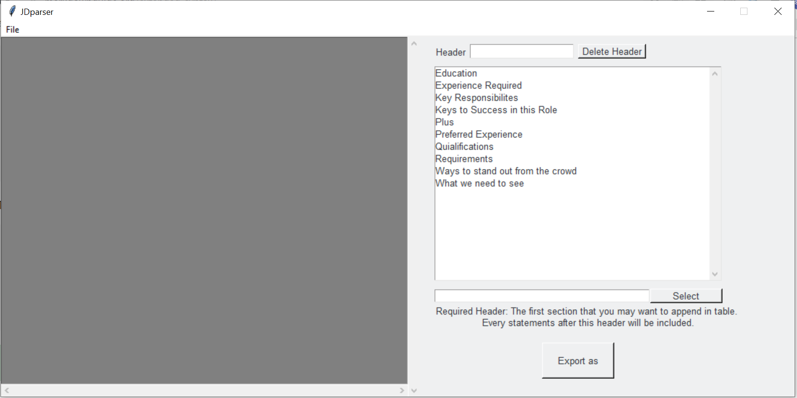

## NER using Doccano / Spacy EN  

This repository provides a basic example of a named entity extraction (NER) task for English model.

### Preparation

Make sure you have Python >= 3.6 and Docker installed.

Setup [Doccano](https://github.com/doccano/doccano):
```shell script
git clone https://github.com/doccano/doccano.git
cd doccano
docker-compose -f docker-compose.prod.yml up -d
```
Or you could simply use one-step deployment(AWS, GCP, [Heroku](https://dashboard.heroku.com/new?template=https%3A%2F%2Fgithub.com%2Fdoccano%2Fdoccano)) for Doccano.

Setup a sample project based on [Spacy](https://spacy.io/):
```shell script
git clone https://github.com/sskorol/ner-spacy-doccano.git
cd ner-spacy-doccano
pip install -r requirements.txt
python3 -m spacy download en_core_web_sm
```

### Annotating Text

- Open Doccano UI: http://localhost or your own deployment platform(I would recommend [Heroku](https://dashboard.heroku.com/new?template=https%3A%2F%2Fgithub.com%2Fdoccano%2Fdoccano))
- Sign in with default credentials: admin / password
- Create a new project
- Watch provided tutorial on a home screen
- Import `./data_to_be_annotated.txt`
- Create a new label, e.g. `CATEGORY`
- Start annotating imported data by marking the following words as `CATEGORY`: product, process, service
- When all the sentences are labeled, export JSONl with text labels
- Save it into project root and give it `categories.jsonl` name

### Model Training

The following command will run a script which adjusts an existing English model with a new `CATEGORY` label and performs a training based on annotated data.  

- Add `CATEFORY` in `LABEL` on the top of ner_train.py.
- Change `DATAFILE` to `categories.jsonl`.


```shell script
python3 ./ner_train.py
```

You should see something similar as an output:
```text
Loaded model 'en_core_web_sm'
Losses {'ner': 846.7723659528049}
Losses {'ner': 623.0931596025007}
Losses {'ner': 689.6105882608678}
------------------------
Entities in 'I'm thinking about several categories. Let me start with the service one.'
CATEGORY service
------------------------
Entities in 'Let’s choose a product'
CATEGORY product
------------------------
Entities in 'It is quite a well-known service'
CATEGORY service
------------------------
```

Verification data should give you a confidence if you model is accurate.

Apart from that, there should be a new NER `./model` folder created.

### Model Testing

Run the following command to test the generated model on a custom data:

```shell script
python3 ner_test.py
```

You should see a similar output which confirms model's confidence level:

```text
Loading from ./model
------------------------
Entities in 'Sounds interesting. Let's say it will be a product!'
CATEGORY product
------------------------
Entities in 'Very nice idea. I'll pick a service probably.'
CATEGORY service
------------------------
Entities in 'Process'
CATEGORY Process
------------------------
``` 


### JDparser

Follow steps above to annotate new data.
If you just want to simply test the performance, change `DATAPATH` to `jd.jsonl` and start training.


I use [tika](https://tika.apache.org/download.html)(server) to parse pdf. The default method is to fetch server.jar file from online, and if you want to run it offline, the only way is to set `TIKA_SERVER_JAR` = `'PATH_OF_FOLDER_CONTAINING_TIKA_SERVER_JAR'` and place  `TIKA_SERVER_JAR.md5` in the same directory. Now, tika would "download" the jar file to the tmp directory in localhost. You could acheive it by setting 
```python
os.environ['TIKA_SERVER_JAR'] = 'path/to/server.jar'
```
in the header of the file.

Run 
```python
python jdparser.py -p path/to/pdf
``` 
to get structured xlsx.

Run
```python
python GUI_class.py
```
to execute it in GUI mode.



You could import pdf file by the file tag, and enter the header of your jd(Since this program parse sections by header). There are some default options for you to use it, and you should assign one header among the box to be "Required header", which means that the remaining context after this header would be parsed and import into the excel file.


2021/12/03 by Wesley